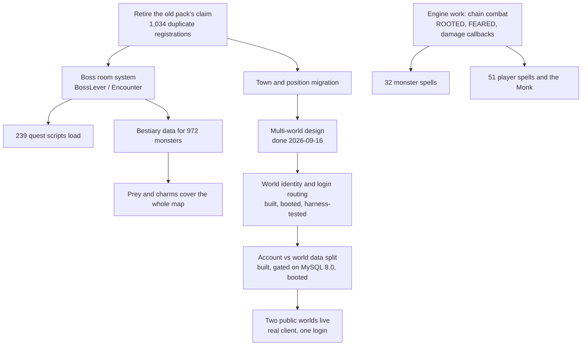

# Avarion OT Roadmap

Everything below is measured, not guessed. The counts come from the working tree and the boot log
on 2026-09-16. When a number changes, this file changes with it.

Order is by what bites a player first. Something that makes a lever fire the wrong script beats
something that annoys us while coding.

---

## Where we are

```
Protocol + transport   ████████████████████  done, verified on a real 15.25 client
Login (session keys)   ████████████████████  done
Item / appearance ids  ████████████████████  done, 42,752 mappings
World content ported   █████████████████░░░  map, monsters, NPCs, quests all in
Side systems           ██████████████░░░░░░  6 real, 6 with named gaps
Quest content working  ███████████████░░░░░  726 of 978 Canary scripts
Client feature surface ████████████░░░░░░░░  45 requests still unanswered
Multi-world            ███████████████████░  two public worlds live, real client plays both
Automated tests        ████████░░░░░░░░░░░░  59 tests; transport, ids, world identity, presence
```

The world itself is real and loads clean: 17.9M tiles, 1,696 monster types, 16,704 zones, 993
houses, zero Lua errors on the last three boots. What's left is depth, not foundations.

---

## The blockers (fix first)

These four are in the way of everything else.

### 1. Two datapacks fight over the same items

The 10.98 pack shipped 312 scripts that still register against item ids the Canary map doesn't use
the same way. Every boot logs it:

```
duplicate item-event registrations   1,034
distinct item ids affected             844
pack scripts still active              312   (196 by id, 97 by aid, 91 by uid)
```

Only the first registration ever fires. Which one wins is whichever loaded first, so a lever can
run the wrong quest's code. This is the one thing on the list that can silently break a player's
progress, and it's why it's first.

**Done means:** zero duplicate warnings at boot, and every lever runs the script that belongs to
this map.

### 2. Boss rooms don't exist

239 quest scripts across 55 quests were held back because they call Canary machinery we have no
answer for.

```
BossLever            60 scripts
:canFightBoss()      19
:getMonster()        19
:setBossCooldown()   14
:removeMonsters()    10
other                117
```

Ten Canary lib layers sit behind those: BossLever, Encounter, Hazard, Lever, Spectators,
ZoneEvent, SimpleTeleport, Set, and two Soul War helpers. BossLever alone wants 20 engine methods
we don't register, Encounter wants 29, Hazard 16.

**Done means:** a boss room can be entered, fought, cleaned up and put on cooldown, and those 239
scripts load.

### 3. Characters are standing in the wrong towns

The map swap renumbered everything and nothing migrated with it. Canary puts Thais at town 8. Our
schema still defaults `players.town_id` to 1, which on this map is the Dawnport tutorial. House
ownership carries the old map's ids too. Migrations stop at 7.

**Done means:** a migration that moves towns, spawn positions and house ownership onto Canary's
numbering, and character creation offering towns that exist.

### 4. Multi-world

One account, many worlds. Decided: a character belongs to one world for life, coins follow the
account, what a purchase unlocks stays with the character. Also decided: a ban bars the account on
every world, and an account may be online on only one world at a time.

Two phases are built, compile clean on GCC 14, pass 59 tests, and have been through two full
multi-agent reviews. Plans: `docs/plans/multi-world-phase1.md` and `multi-world-phase2.md`.

**Phase 1 — world identity and login routing.**

| Piece | What it does |
| --- | --- |
| `BlackTek::World::Registry` | `config/worlds.toml` is the world list; a world refuses to boot if its own row disagrees with its ip, port or schema |
| Wrong-world rejection | The preamble we used to print and throw away now refuses a client that dialled the wrong world, after XTEA so the message is readable |
| Shared auth schema | `accounts`, `account_sessions` and `store_history` live in one schema; each world reaches them through views of the same name, so no existing query changes and the third-party login service still works |
| Cross-world character list | One schema-qualified query per world on the one connection; each world's `players` is the source of truth |
| In-binary login | `ProtocolLoginModern` on 7171 serves the registry as a real world list |
| Coin delta | `SET coins = <absolute>` became a guarded `coins + delta`, so two worlds can't overwrite each other's spending |

**Phase 2 — the account/world data split.**

| Piece | What it does |
| --- | --- |
| Account-wide bans | `account_bans` and `account_ban_history` join the auth schema and carry `banned_by_name`; an expired ban is retired behind a guarded delete, so N worlds noticing it write one history row, not N |
| One session per account | A claim in the auth schema, taken after the ban check and before the waiting list, released on logout after the save. Exempt: account type Gamemaster and above, and any world with `allow_clones` |
| Crash recovery | Worlds heartbeat every 10 s; a world silent for 45 s loses its claims, and a recovering world kicks anyone whose claim was taken |
| Migration version 8 | Adds `banned_by_name` and drops the foreign keys that deleted a GM's bans when the GM's character was deleted |
| `harness/auth_schema_gate.sql` | Proves the whole database design on a given server; re-run whenever `auth_schema.sql` or the MySQL version changes |

**What has been proven, not just read:**

- The gate passed three times on the real server. Views are writable, cross-schema foreign keys are
  enforced and cascade, a resent ban delete writes nothing, and a login race is settled by the
  primary key alone.
- The server booted against the real database: migration 8 ran and left no foreign key pointing at
  `players`.
- `harness/modern_client.py` logs in and walks, which proves the first-frame padding trim that runs
  on every modern game connection. `harness/login_client.py` gets a world list from port 7171.
- An active ban refused login naming its issuer; an expired ban let the login through and left
  exactly one history row.

**Findings worth keeping:**

**The database is MySQL 8.0, not MariaDB** — whatever docker-compose says. On it, unsigned arithmetic
that would go below zero raises `ERROR 1690` instead of going negative. That broke the phase-1 coin
guard silently: unaffordable purchases were refused by a database error rather than the guard, and
logged as write failures. Found by testing on the server; the guard now casts to signed.

**Detection can't bound a write it doesn't control.** The first presence design let a recovering
world lose a claim to a takeover already in flight, then tried to catch it with a follow-up check.
That can't work: `executeQuery` retries a lost connection indefinitely, so the takeover can land
arbitrarily late. The takeover now re-checks at the moment it writes that the holder is still stale,
and a recovering world measures its stall on the database's clock, which is the clock every other
world judges expiry by.

**Port 7171 is a client-side constant.** A 15.25 client goes to HTTP login unless the port is exactly
7171, so the in-binary login server has to live there, and anything colliding with it must move.

**Two worlds have run side by side** (2026-09-16, one host, small map, isolated schemas). Live:
the character list spanning both worlds; an account online on one world refused on the other, naming
where; logout freeing it at once; a killed world's claim refused inside the lease and taken over after
it; a killed world that restarted clearing its own claim in 2 s; a frozen world kicking exactly the
one player whose claim was taken, the second it woke; a ban issued on one world enforced on the other
with the right issuer; the Gamemaster and `allow_clones` exemptions; and wrong-world rejection. The
full list is in `docs/deployment/multi-world.md`.

**Three worlds are live on the production host.** The single-world deployment was converted in
place on 2026-09-16, backed up first: `Avarion` (Canary map, port 7172, schema `blacktek`) and
`Avarion Test` (the small `forgotten` map, port 7173, schema `arkot_test`). On 2026-09-20 they were
joined by `Testing` (small map, port 7174, schema `arkot_testing`), which is **private**: its world
row names a role, and only accounts holding it — or staff — may enter. The first two were called
`ArkOT` and `ArkOT Test` until that same day; the schema names still carry the old spelling, because
renaming a schema is a migration and a name is not. The
website ([arkot-web](https://github.com/unbridledpc/arkot-web)) now reads the servers' own
`config/worlds.toml` and does two new things:

- **Character creation picks a world.** The town list follows the chosen world's map, a name is
  refused if any world has it, and the 10-character limit counts every world.
- **It answers the client's HTTP login on 7171**, replacing the single-world login container. One
  login returns every world and every character, each tagged with its world; the account page shows
  the same list with a World column.

Observed with a real 15.25 client: the owner created a character on `Avarion Test` from the website,
saw it next to the `Avarion` characters after one login, and played it. Before that cutover, a staging
copy of the site passed the same path with a throwaway account: characters on both worlds, one
session key accepted by both game servers, and a login on `Avarion Test` refused while the account was
online on `Avarion`. The in-binary login on 7171 is built but unused in production, because the shipped
client logs in over HTTP.

**A new world needs its game port forwarded.** The first live attempt on `Avarion Test` failed with
the client's "Connection refused (ERROR 111)": the server was listening and the VM firewall was open,
but the router's forwarded range stopped short of it. The ports were renumbered contiguously the
same day — 7171 login, 7172, 7173, 7174 for the worlds, status ports at 7181 upward — so every world
falls inside a range the router already forwards.

**Not proven yet:** behaviour under player load, and worlds on separate hosts.

**Done means:** everything above holding under real load.

---

## Content gaps

Real content that's missing or half-ported. None of it blocks anything else.

| Gap | Size | Notes |
| --- | --- | --- |
| 972 monsters with no bestiary entry | `████████████░░░░` 972 / 1,712 | Can't be tracked, charmed or offered as prey. 741 have one. |
| 40 monster spells that don't exist | `█████░░░░░░░░░░░` 83 monsters, 109 entries | 32 need engine work first: chain combat, `CONDITION_ROOTED`, `CONDITION_FEARED`, damage callbacks. The other 8 are scriptable now. |
| 51 player spells + the Monk | `███████░░░░░░░░░` | Includes the five wheel Avatars, the vocation familiars, Executioner's Throw, Divine Grenade. |
| 69 NPCs can't hand out their quest | `███░░░░░░░░░░░░░` 79 callbacks | They greet, sell and answer keywords fine. The quest callback needs Canary's npc object for its own shop windows. |
| 39 monster callbacks commented out | `██░░░░░░░░░░░░░░` | 22 hooks we don't bind, 17 calling methods we lack. Silences the Goshnar bosses, the Cobra bosses, Oberon. |
| 48 loot entries dropped | `█░░░░░░░░░░░░░░░` | Items with no id on our side. Demonic matter, Mitmah pieces and similar just don't drop. |
| 7,729 generated items with no name | `████████░░░░░░░░` of 20,805 | They render and work. The client has nothing to call them. |
| 20 quest log missions show `\|STATE\|` | `█░░░░░░░░░░░░░░░` 20 of 369 | Counter missions with no written description. |
| Raids | `░░░░░░░░░░░░░░░░` none | Only upstream's three demo raids exist. Nothing authored for this map. |

---

## Systems with named gaps

Six side systems are real and working. Six have a specific hole.

| System | State | The hole |
| --- | --- | --- |
| Charms | working | — |
| Forge | working | — |
| Store | working | — |
| Item events | working | — |
| Bestiary engine | working | data only, see above |
| Transport / login / ids | working | — |
| Prey | gap | Third slot is advertised as a store unlock. Nothing unlocks it. |
| Wheel | gap | Perks, instants and stages are stored and exposed to Lua. No script calls them, so they do nothing. |
| Market | gap | Forge tiers exist on items. Every listing goes out as tier 0. |
| Cyclopedia | gap | Combat pages send about 57 hard-coded zeros: crit, leech, dodge, mitigation, reflection. |
| Client surface | gap | 45 requests unanswered. Imbuements, bosstiary, quick loot, depot search, party analyser. |
| Profiles | gap | 13.40 and 14.12 are declared and never tested. Treat them as unsupported. |

---

## Order of work



Two things can run in parallel with all of it: bestiary data entry, and the engine work behind the
missing spells. Neither touches the blockers.

---

## Housekeeping

Not urgent, but it's debt and it's ours.

| Item | Why it matters |
| --- | --- |
| 59 tests, transport, ids and multi-world only | Nothing covers bestiary, prey, forge, wheel, store or quests. Those are checked by driving a real client by hand, which doesn't scale. |
| CI compiles but never tests | Both workflows build. Neither runs `./blacktek_tests`. |
| docker-compose can't serve a world | Still targets 7171/7172/7173, never copies `config/`, and the map isn't where it expects. |
| One unexplained segfault | After about 8 hours under a 20,000-bot load. Never reproduced, never explained. Predates the current map. |
| `CloakOfTerrorHealthLoss` missing | A ported monster asks for a creature event we didn't bring across. 150 warnings every boot. |
| 5 bestiary race-id collisions | Butterfly variants and the Druid's/Monk's Apparition pair share ids. |
| `STATUS.md` is a lap behind | Last dated entry is 2026-09-14 and gate F still calls the retired 10.98 map the world. |
| `bootstrap.sh` cannot finish | After the `x64-linux` install succeeds it runs `vcpkg install --triplet x64-linux-static`, and that triplet no longer exists. Premake and the dynamic deps are already done by then, so `make` still works — but the script always exits 1. |
| Nothing pins the compiler | `bootstrap.sh` refuses GCC below 10 while the code needs 14+, so a default `c++` of 13 builds 62 errors deep into `console.h` before failing. |
| docker-compose names the wrong database | It says `mariadb:latest`; the deployment runs `mysql:8.0`. They differ in exactly the arithmetic that broke the coin guard. |
| A migration failure doesn't stop boot | `DatabaseManager::updateDatabase()` returns nothing, so a failed migration just stops migrating. `banned_by_name` has its own post-migration check now; nothing else does. |
| Ports above 65535 silently disable a listener | A configured port like 65536 passes the `!= 0` check and wraps to 0 in the `uint16_t` cast, so the listener never binds. |
| A failed coin transfer destroys coins | `System::transfer` debits the sender through the guarded path, then credits the recipient with an unguarded `UPDATE` whose failure is never checked or compensated. |
| Database-channel warnings sit in a buffer | During the live multi-world run, reconcile warnings reached `logs/database/` only when the process exited cleanly. An operator tailing that log can't see presence problems as they happen. |
| A character on another world gets the wrong refusal | A session key naming a character that lives on a different world is refused with "Your session has expired", because the lookup finds no character here. Still a refusal, and the real client never sends it, but the message misleads. |
| `harness/modern_client.py` misreads frames over a network | It reads with `MSG_WAITALL` on a socket with a timeout, which Python makes non-blocking, so a large first frame arrives short off loopback. Loop on `recv` instead. |
| `DBTransaction::begin()` can unlock a mutex it never locked | It sets its started state before `BEGIN` can fail, so the destructor rolls back and unlocks. Undefined behaviour on a failed `BEGIN`. |

---

## Not planned

**10.98 and other legacy protocols.** Retired on purpose. The listeners ship disabled and the
server refuses to run two generations at once.

**13.40 and 14.12.** They're in the profile registry with a feature mask, but neither has ever met
a real client of that band and the login layout is assumed from 15.25. A declared profile is not a
promise. They stay unsupported until somebody tests them.

**Character transfer between worlds.** Decided against. A character belongs to one world.
