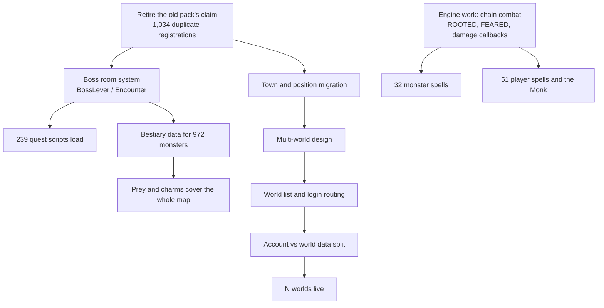

# ArkOT Roadmap

Everything below is measured, not guessed. The counts come from the working tree and the boot log
on 2026-09-16. When a number changes, this file changes with it.

Order is by what bites a player first. Something that makes a lever fire the wrong script beats
something that annoys us while coding.

---

## Where we are

```
Protocol + transport   ████████████████████  done, verified on a real 15.25 client
Login (session keys)   ████████████████████  done
Item / appearance ids  ████████████████████  done, 42,752 mappings
World content ported   █████████████████░░░  map, monsters, NPCs, quests all in
Side systems           ██████████████░░░░░░  6 real, 6 with named gaps
Quest content working  ███████████████░░░░░  726 of 978 Canary scripts
Client feature surface ████████████░░░░░░░░  45 requests still unanswered
Automated tests        █████░░░░░░░░░░░░░░░  13 golden tests, transport and ids only
```

The world itself is real and loads clean: 17.9M tiles, 1,696 monster types, 16,704 zones, 993
houses, zero Lua errors on the last three boots. What's left is depth, not foundations.

---

## The blockers (fix first)

These four are in the way of everything else.

### 1. Two datapacks fight over the same items

The 10.98 pack shipped 312 scripts that still register against item ids the Canary map doesn't use
the same way. Every boot logs it:

```
duplicate item-event registrations   1,034
distinct item ids affected             844
pack scripts still active              312   (196 by id, 97 by aid, 91 by uid)
```

Only the first registration ever fires. Which one wins is whichever loaded first, so a lever can
run the wrong quest's code. This is the one thing on the list that can silently break a player's
progress, and it's why it's first.

**Done means:** zero duplicate warnings at boot, and every lever runs the script that belongs to
this map.

### 2. Boss rooms don't exist

239 quest scripts across 55 quests were held back because they call Canary machinery we have no
answer for.

```
BossLever            60 scripts
:canFightBoss()      19
:getMonster()        19
:setBossCooldown()   14
:removeMonsters()    10
other                117
```

Ten Canary lib layers sit behind those: BossLever, Encounter, Hazard, Lever, Spectators,
ZoneEvent, SimpleTeleport, Set, and two Soul War helpers. BossLever alone wants 20 engine methods
we don't register, Encounter wants 29, Hazard 16.

**Done means:** a boss room can be entered, fought, cleaned up and put on cooldown, and those 239
scripts load.

### 3. Characters are standing in the wrong towns

The map swap renumbered everything and nothing migrated with it. Canary puts Thais at town 8. Our
schema still defaults `players.town_id` to 1, which on this map is the Dawnport tutorial. House
ownership carries the old map's ids too. Migrations stop at 7.

**Done means:** a migration that moves towns, spawn positions and house ownership onto Canary's
numbering, and character creation offering towns that exist.

### 4. Multi-world

One account, many worlds. Decided: a character belongs to one world for life, coins follow the
account, what a purchase unlocks stays with the character.

The design has to land before the code. The two decisions that shape everything are who owns the
world list (the external login service already returns a `worlds[]` array) and whether it's one
database per world or one database keyed by world id. The coins decision forces the second one to
be deliberate, because the cheap option quietly forks the account row per world.

Useful thing we already have: the 15.25 client sends a plaintext world name before the game
protocol starts. We read it, print it, and throw it away. The wire already carries what we need.

**Done means:** a world list in the client, characters that only appear on their own world, and one
coin balance across all of them.

---

## Content gaps

Real content that's missing or half-ported. None of it blocks anything else.

| Gap | Size | Notes |
| --- | --- | --- |
| 972 monsters with no bestiary entry | `████████████░░░░` 972 / 1,712 | Can't be tracked, charmed or offered as prey. 741 have one. |
| 40 monster spells that don't exist | `█████░░░░░░░░░░░` 83 monsters, 109 entries | 32 need engine work first: chain combat, `CONDITION_ROOTED`, `CONDITION_FEARED`, damage callbacks. The other 8 are scriptable now. |
| 51 player spells + the Monk | `███████░░░░░░░░░` | Includes the five wheel Avatars, the vocation familiars, Executioner's Throw, Divine Grenade. |
| 69 NPCs can't hand out their quest | `███░░░░░░░░░░░░░` 79 callbacks | They greet, sell and answer keywords fine. The quest callback needs Canary's npc object for its own shop windows. |
| 39 monster callbacks commented out | `██░░░░░░░░░░░░░░` | 22 hooks we don't bind, 17 calling methods we lack. Silences the Goshnar bosses, the Cobra bosses, Oberon. |
| 48 loot entries dropped | `█░░░░░░░░░░░░░░░` | Items with no id on our side. Demonic matter, Mitmah pieces and similar just don't drop. |
| 7,729 generated items with no name | `████████░░░░░░░░` of 20,805 | They render and work. The client has nothing to call them. |
| 20 quest log missions show `\|STATE\|` | `█░░░░░░░░░░░░░░░` 20 of 369 | Counter missions with no written description. |
| Raids | `░░░░░░░░░░░░░░░░` none | Only upstream's three demo raids exist. Nothing authored for this map. |

---

## Systems with named gaps

Six side systems are real and working. Six have a specific hole.

| System | State | The hole |
| --- | --- | --- |
| Charms | working | — |
| Forge | working | — |
| Store | working | — |
| Item events | working | — |
| Bestiary engine | working | data only, see above |
| Transport / login / ids | working | — |
| Prey | gap | Third slot is advertised as a store unlock. Nothing unlocks it. |
| Wheel | gap | Perks, instants and stages are stored and exposed to Lua. No script calls them, so they do nothing. |
| Market | gap | Forge tiers exist on items. Every listing goes out as tier 0. |
| Cyclopedia | gap | Combat pages send about 57 hard-coded zeros: crit, leech, dodge, mitigation, reflection. |
| Client surface | gap | 45 requests unanswered. Imbuements, bosstiary, quick loot, depot search, party analyser. |
| Profiles | gap | 13.40 and 14.12 are declared and never tested. Treat them as unsupported. |

---

## Order of work



Two things can run in parallel with all of it: bestiary data entry, and the engine work behind the
missing spells. Neither touches the blockers.

---

## Housekeeping

Not urgent, but it's debt and it's ours.

| Item | Why it matters |
| --- | --- |
| 13 tests, transport and ids only | Nothing covers bestiary, prey, forge, wheel, store or quests. Those are checked by driving a real client by hand, which doesn't scale. |
| CI compiles but never tests | Both workflows build. Neither runs `./blacktek_tests`. |
| docker-compose can't serve a world | Still targets 7171/7172/7173, never copies `config/`, and the map isn't where it expects. |
| One unexplained segfault | After about 8 hours under a 20,000-bot load. Never reproduced, never explained. Predates the current map. |
| `CloakOfTerrorHealthLoss` missing | A ported monster asks for a creature event we didn't bring across. 150 warnings every boot. |
| 5 bestiary race-id collisions | Butterfly variants and the Druid's/Monk's Apparition pair share ids. |
| `STATUS.md` is a lap behind | Last dated entry is 2026-09-14 and gate F still calls the retired 10.98 map the world. |

---

## Not planned

**10.98 and other legacy protocols.** Retired on purpose. The listeners ship disabled and the
server refuses to run two generations at once.

**13.40 and 14.12.** They're in the profile registry with a feature mask, but neither has ever met
a real client of that band and the login layout is assumed from 15.25. A declared profile is not a
promise. They stay unsupported until somebody tests them.

**Character transfer between worlds.** Decided against. A character belongs to one world.
